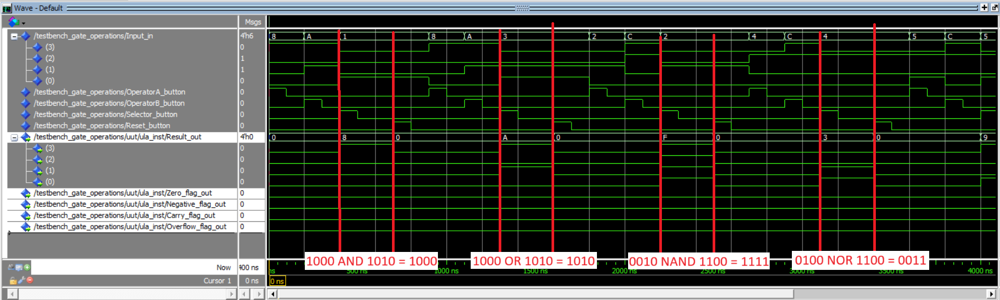
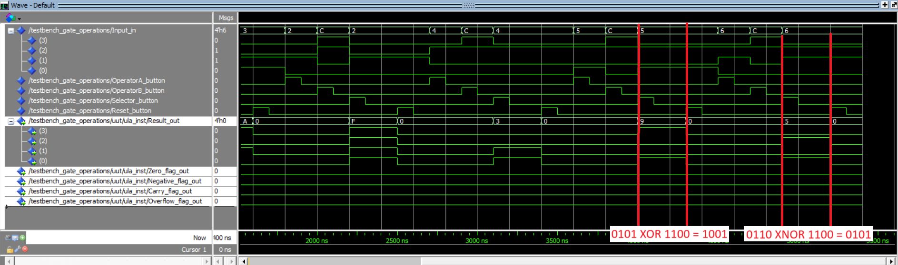

1. Install Quartus
2. Get license on https://licensing.intel.com/psg/s/?language=en_US&q_type=full&q_ver=2025.02&lic_ver=2025.02&dsn=b2eefc06&nic=f20af63d28ad&nic=e00af63d28ae&nic=e20af63d28ad&nic=88a4c290dd51&nic=e00af63d28ad
3. After registration, click "Sign up for Evaluation or No-Cost Licenses" and follow the instructions (check https://www.youtube.com/watch?v=F6FvXga4f1A for guidance).
4. Download the license file sent to your email.
5. Go to system environment variables and add a new variable called `LM_LICENSE_FILE` with the path to the license file.
6. Open Quartus and go to Tools > License Setup. Select the option "Use LM_LICENSE_FILE".

Obs: perhaps you need to change the path to Questa from `c:/intelfpga_standard/24.1std/questa_fe/win64` to `c:/intelfpga/24.1std/questa_fse/win64` as the  trial license only works for starter edition ((https://community.intel.com/t5/Intel-FPGA-Software-Installation/Questa-License-Issue/m-p/1672274/highlight/true#M6506). In order to do so, you go to Tools > Options > EDA Tool Options > Questa Intel FPGA and change the path.

----
<!-- Open QuestaSim (or ModelSim).

Create a new project (File > New > Project).

Add your files (main.vhd, ula.vhd, testbench_gate_operations.vhd).

Compile all files (Compile > Compile All).

Start simulation (Simulate > Start Simulation), select testbench_gate_operations.

Run the simulation (Run > Run -All).

View waveforms (Add Wave and check signals). -->
Runing Questa:

The testbench is in the `modules` folder under the name `testbench_gate_operations.vhd`.

1. Open Questa (comes with Quartus).
2. Go to File > New > Project.
3. Add your files (main.vhd, ula.vhd, testbench_gate_operations.vhd).
4. Compile all files (Compile > Compile All).
5. Start simulation (Simulate > Start Simulation), select testbench_gate_operations. If you don't see the testbench_gate_operations, go to the `work` folder and open the `testbench_gate_operations` or the `testbench_arithmetic_operations` file.
6. Run the simulation (Run > Run -All).
7. View waveforms (Add Wave and check signals). In order to add the input signals, you must have the testbench file selected. In order to add the output signals, you must have `ula_inst` selected.

The testbench will generate different inputs for the 'A', 'B' and 'Selector' operators. The testbench will also generate the expected output for each operation as a signal, which can be visualized in the waveform. The flags for Zero, Overflow and Carry are also present.

# Simulating gate opereations:

# Simulating arithmetic operations:

